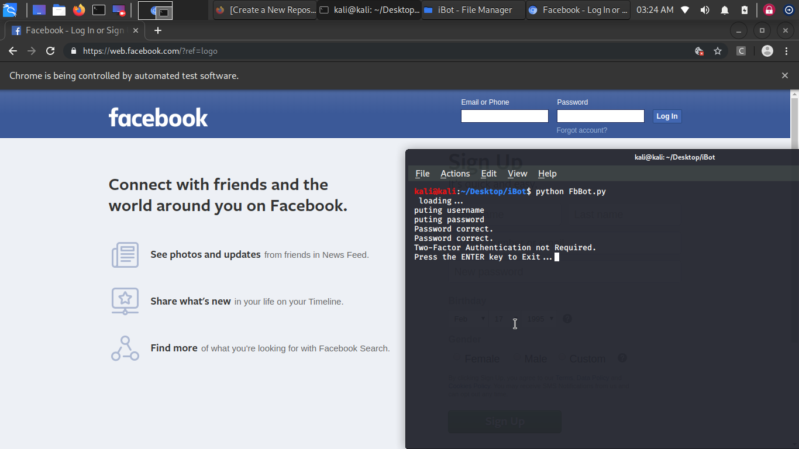

# FbBot

a robot for controlling facebook 🥢bow_and_arrow fishing_pole_and_fishkeyboardjoysticklock_with_ink_pen closed_lock_with_key




### Languages :
* PYTHON3

### System :
* Linux

# How to get this tool
```
git clone https://github.com/byRo0t96/FbBot.git
cd FbBot
```

# How to run
```
python3 install.py
python3 FbBot.py
```

## Release History
```
- Version Beta [22-02-2020]
...
```


### Contact :

##### Mail : by.root96@gmail.com


